# Reddit App Deployment on Amazon EKS

End-to-end DevSecOps pipeline — Reddit clone containerised, security-scanned, and deployed to AWS EKS via GitOps (ArgoCD), with cluster monitoring via Prometheus and Grafana.

---

## Architecture

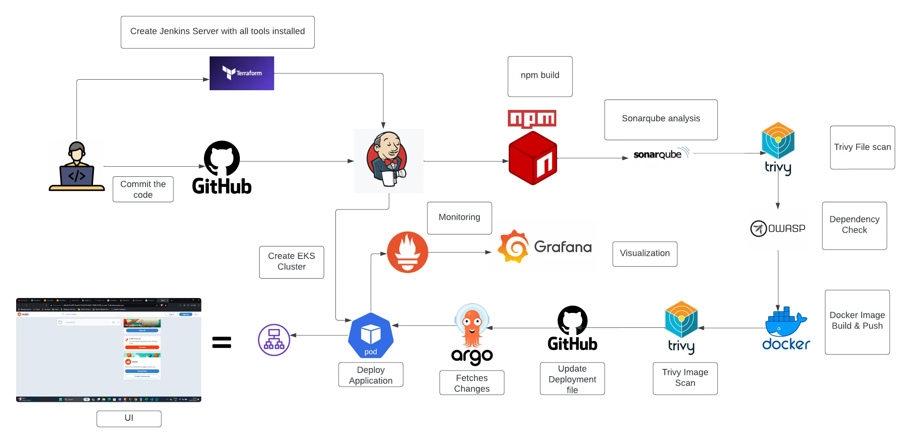

**Flow:**
```
Code push → GitHub → Jenkins CI
  ├── npm build
  ├── Trivy FS scan
  ├── SonarQube analysis + Quality Gate
  ├── OWASP Dependency Check
  ├── Docker build & push → Docker Hub
  ├── Trivy image scan
  └── Update deployment.yml with build tag
              ↓
          ArgoCD (fetches changes from GitHub)
              ↓
        EKS — Deploy Application
              ↓
       Prometheus → Grafana (monitoring)
```

---

## Stack

| Layer | Tools |
|---|---|
| Infrastructure | Terraform · AWS EKS (K8s 1.31) |
| CI | Jenkins |
| Security | Trivy · SonarQube · OWASP Dependency Check |
| Registry | Docker Hub (`angadvm/my-reddit-angad`) |
| GitOps | ArgoCD v3.4.4 |
| Monitoring | Prometheus (kube-prometheus-stack) · Grafana |

---

## What was built

### 1. EKS Cluster — `Reddit-EKS-Cluster`

Provisioned via Jenkins pipeline running `terraform apply`. Two `t2.medium` nodes in node group `Reddit-Node-Group`, both in **Ready** state on Kubernetes 1.31.

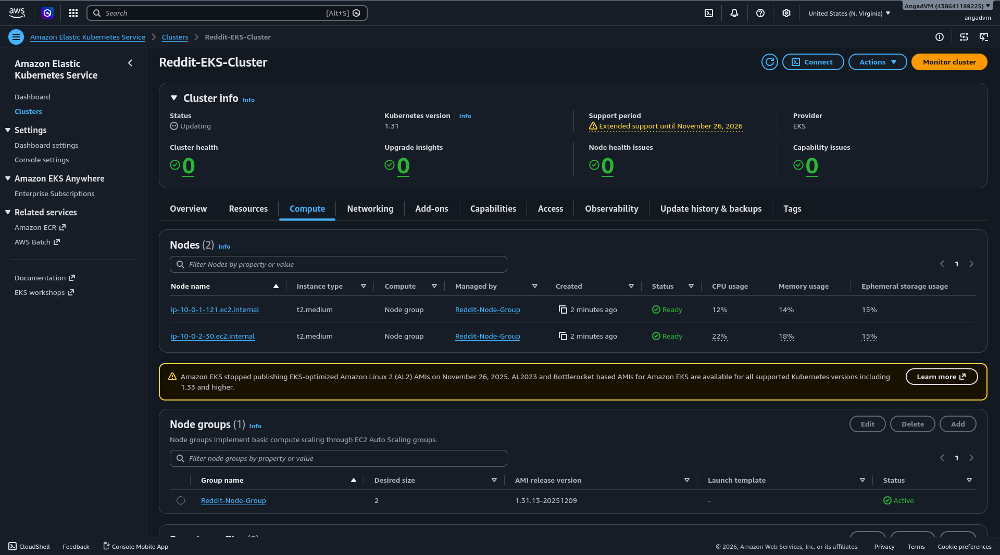

---

### 2. Jenkins Pipeline 1 — EKS provisioning

Stages: `Checkout SCM → Checkout from Git → Initializing Terraform → Validate Terraform Code → Terraform Plan → Terraform Action`

Ran `terraform apply -auto-approve -var-file=variables.tfvars`. Provisioned VPC, subnets, IAM roles (`EKSClusterRole`, `NodeGroupRole`), and the EKS cluster in ~10 min.

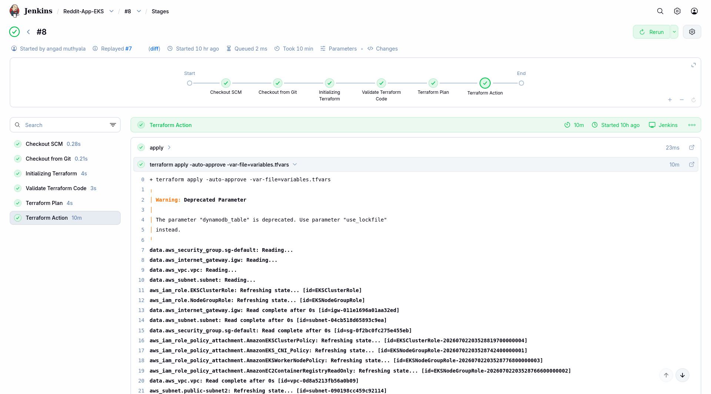

---

### 3. Jenkins Pipeline 2 — CI/CD (build #17)

Stages: `Checkout SCM → clean workspace → Checkout from Git → Install Dependencies → TRIVY FS SCAN → Sonarqube Analysis → Quality Gate → Docker Build & Push → TRIVY IMAGE SCAN`

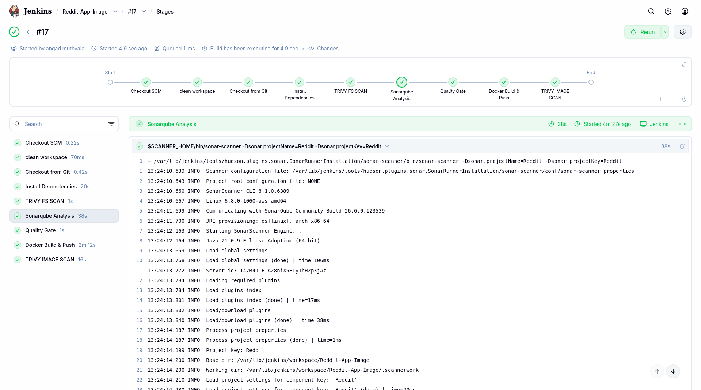

**SonarQube result — Quality Gate: Passed**
- 7.1k lines of code analysed
- Security: 4 open issues (C) · Reliability: 8 open issues (C) · Maintainability: 154 (A)
- Duplications: 1.2% · Security Hotspots: 3

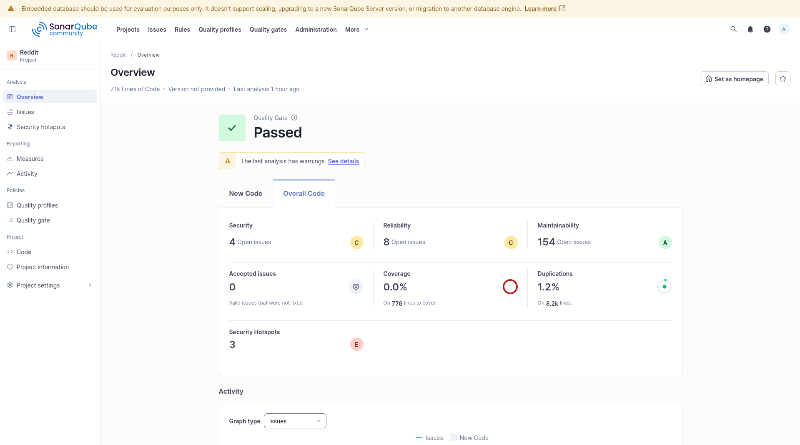

**Docker Hub — `angadvm/my-reddit-angad`**
- Build tag auto-updated on each Jenkins run (tags: 17, 8, 6...)
- Image size: 174.42 MB (linux/amd64)
- 39 pulls total

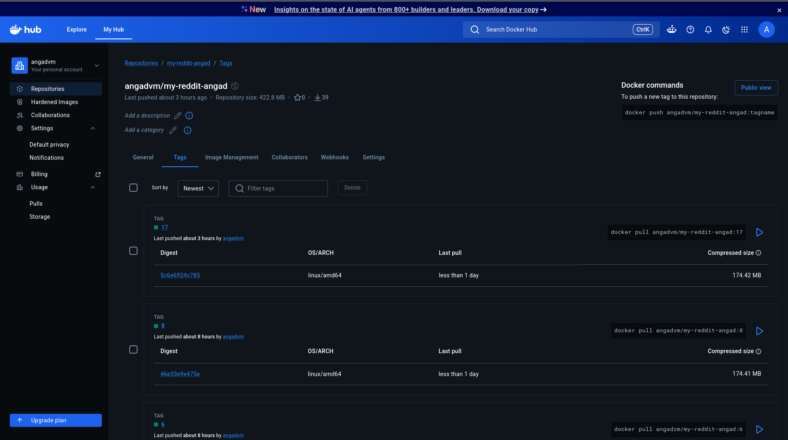

---

### 4. ArgoCD — GitOps sync

ArgoCD watches the GitHub config repo and syncs on every change to `deployment.yml`.

- **Sync status:** Synced to HEAD (`b3176bb`) — auto sync enabled
- **Last sync:** Succeeded (commit: `add correct credentials`)
- **Resources synced:** `reddit-clone-service` (svc) · `reddit-clone-deployment` (deploy + replicaset) · `ingress-reddit-app` (ing)
- **Pods:** 2/2 running · 0 degraded · 0 out of sync

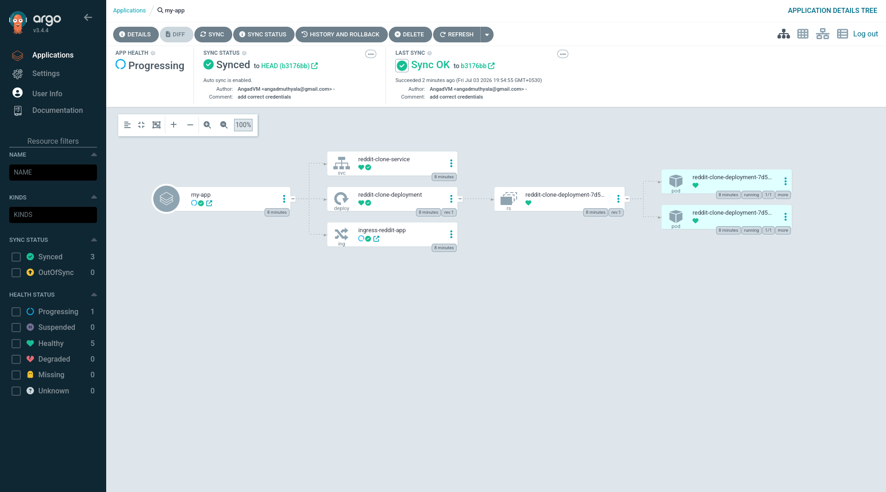

---

### 5. Live cluster state


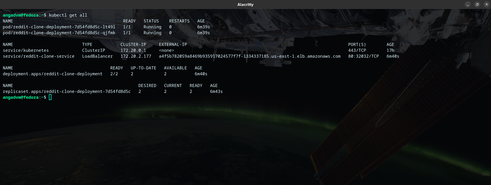

---

### 6. App — live on EKS

Reddit clone accessible via the AWS LoadBalancer external IP.

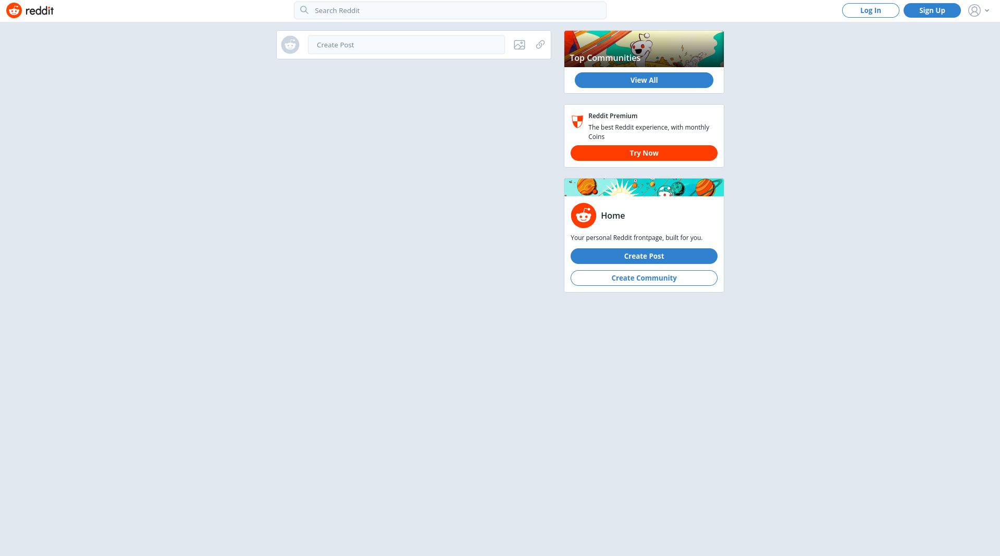

---

### 7. Monitoring — Prometheus + Grafana

Prometheus scraping all cluster targets via ServiceMonitors:
- `prometheus-grafana` — 1/1 up
- `prometheus-kube-prometheus-alertmanager` — 1/1 up
- `prometheus-kube-prometheus-apiserver` — 2/2 up
- `prometheus-kube-prometheus-coredns` — 2/2 up

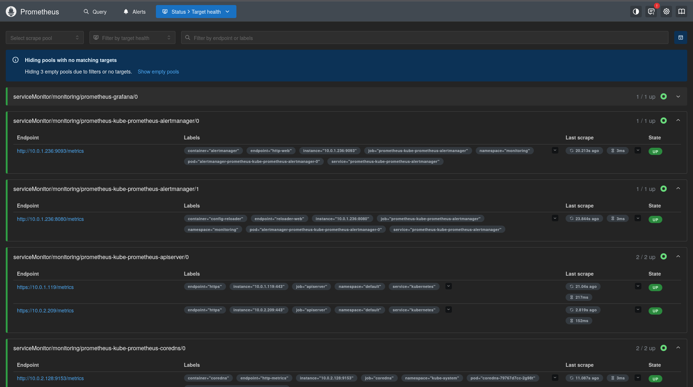

Grafana dashboard — **Kubernetes cluster monitoring (via Prometheus)**:
- Network I/O pressure: ~500 KB/s baseline
- Container CPU usage: ~0.02 cores avg across EKS system containers
- Container memory usage: 43–470 MB per container

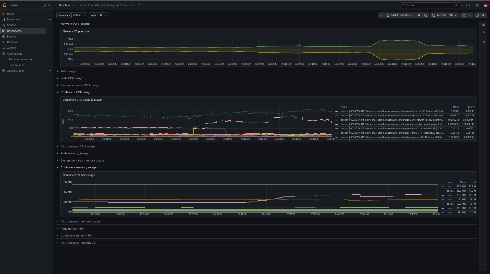

---

## Key decisions

- **ArgoCD pull-based delivery** — CI never runs `kubectl`. It only updates `deployment.yml` with the new image tag. ArgoCD detects the change and syncs to the cluster. Cluster credentials stay inside the cluster.
- **Three security gates before push** — Trivy FS scan on source, SonarQube quality gate, OWASP dependency check, and Trivy image scan all run before any image is pushed to Docker Hub or deployed to EKS.
- **Build tag = image tag** — Jenkins build number used as Docker image tag (`:17`, `:8`...), written back into `deployment.yml` automatically. Every deployed version is traceable to a specific Jenkins run.

---

## Cleanup

```bash
# Destroy EKS cluster
eksctl delete cluster --name Reddit-EKS-Cluster --region us-east-1

# Destroy Jenkins EC2 infra
cd Jenkins-Server-TF/
terraform destroy -var-file=variables.tfvars --auto-approve
```